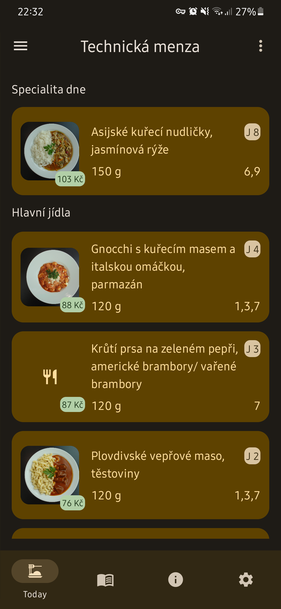
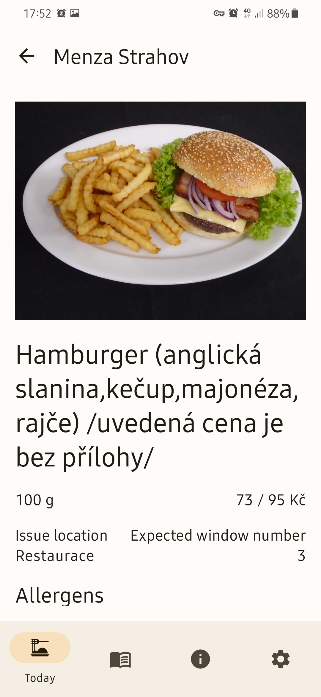
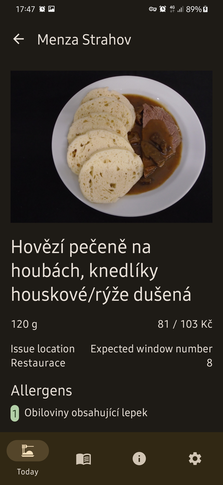
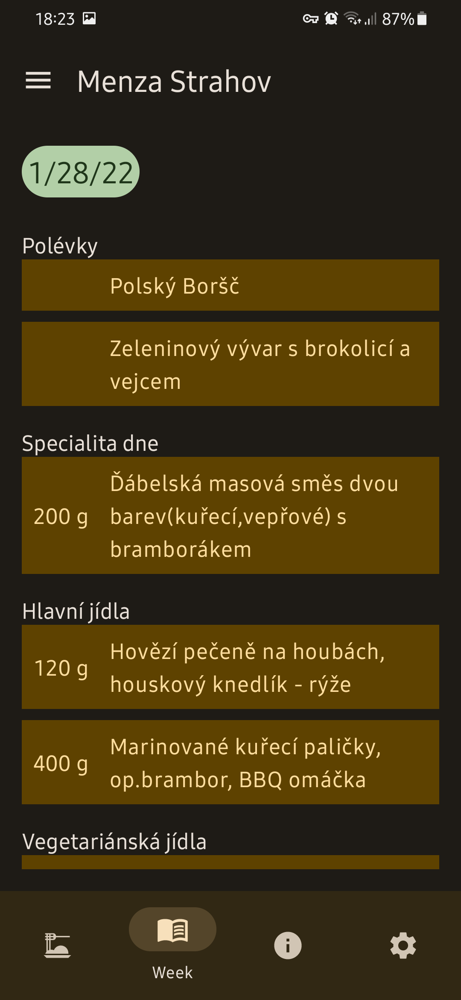
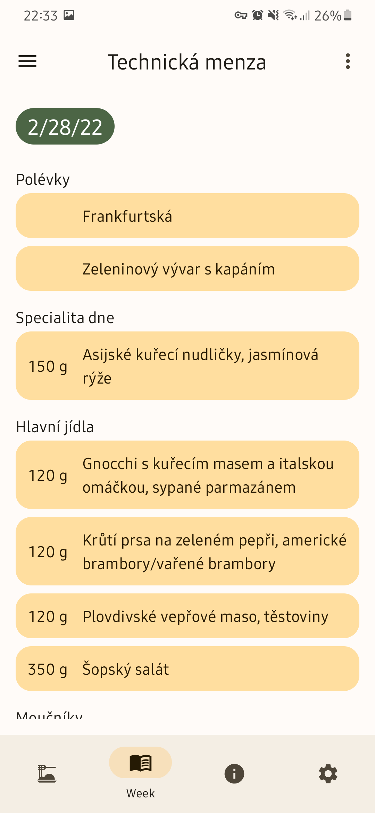
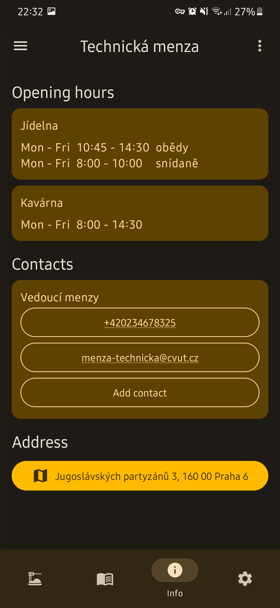
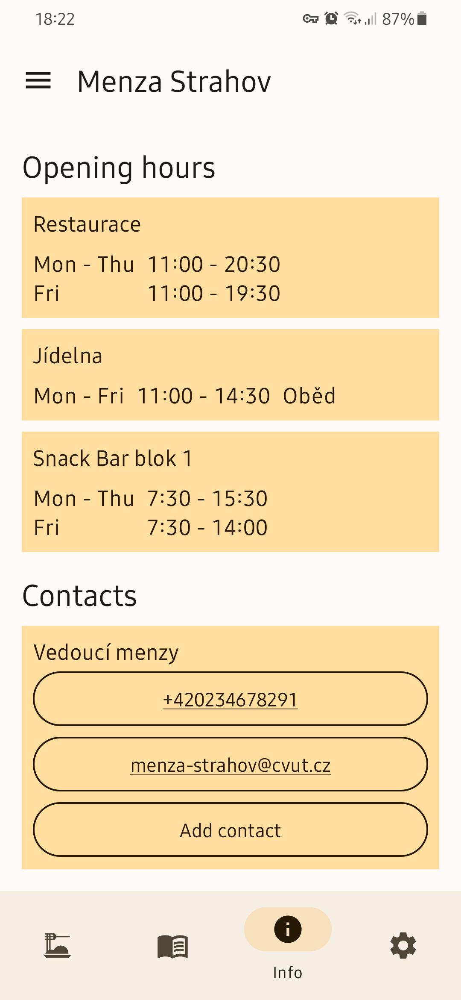

# CTU Menza

This Android app shows dish menus for CTU cafeterias from [agata.suz.cvut.cz](https://agata.suz.cvut.cz/) web in much more pleasant and usable way for phones. It shows today and week menu, opening hours, contacts, announcements and address for all the canteens. It supports dark mode and Material You including Android 12 dynamic theming.

Core parts are written in Kotlin Multiplatform, support for JVM target can be added right away. Other targets requires more work (non JVM web scraping library required), but it still may be manageable for somebody to port this codebase to native or js platforms.

##### What does 'Menza' mean?

Menza is Czech word for student's canteen.

F-Droid coming hopefully soon.

## Technologies

- Jetpack libraries (Compose, ...)
- SQLDelight
- Skrape.it
- Coil-kt
- Kotlin Multiplatform

## Features

- Today menu + dish details
- Week menu
- Menza opening hours, contacts, announcements and address

## User experience

- Dark theme
- Support for Android 12 Material You dynamic theming
- Images download switch on metered networks (~0.7 MB per image)
- Image caching
- No private data collection
- Proper landscape mode and large screen devices support

## Screenshots

## Structure

- app - Android app code - UI, viewmodels, caching
- entity - entities representing data accessible from web
- scrapping - abstract and JMV/Android implementation for web straping
- storage.db - database for storing persistent entities - contact info, menza list, ...
- storage.repo - repositories for common access to data from web or local database

## License

Menza is licensed under `GNU GPL v3.0` license.