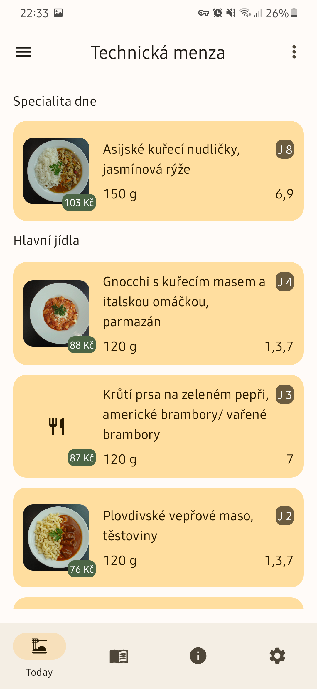

# CTU Menza

This Android app shows dish menus for CTU cafeterias from the [agata.suz.cvut.cz](https://agata.suz.cvut.cz/) 
and [studentcatering.cz](http://studentcatering.cz/jidelni-listek/) websites
in a much more pleasant and usable way for phones.
It shows today's and this week's menu, opening hours, contacts, announcements and addresses for all canteens.

Core parts are written in Kotlin Multiplatform, support for JVM target can be added right away. Other targets require more work (non-JVM web scraping library required), but it still may be manageable for somebody to port this codebase to native or js platforms.

See **contributing** below.

##### What does 'Menza' mean?

Menza is the Czech word for school cafeteria.

## Related projects
- [Menza CLI (LastaApps)](https://github.com/Lastaapps/menza-cli)
- [Menza BE (LastaApps)](https://github.com/Lastaapps/menza-backend)

## Libraries

- AndroidX (Compose, ...)
- ArrowKt
- Decompose
- SQLDelight
- Koin
- Coil-kt
- Ktor
- And more

The core of the all in written in Kotlin Multiplatform!

## Features

- Today's menu + dish details
- This week's menu
- Menza opening hours, contacts, announcements and addresses
- Account balance, for setup see [tutorial](docs/STRAVNIK_SIGNUP.md)

## User experience

- Dark theme
- Many themes along with support for Android 12 Material You dynamic theming
- Images download switch on metered networks (~0.7 MB per image)
- Image caching
- No private data collection
- Proper landscape mode and large screen device support

## Screenshots

## Contributing and project structure

See [CONTRIBUTING.md](docs/CONTRIBUTING.md).

#### Data sources

Most of the data is obtained from the official Agata API, see the documentation [here](https://agata.suz.cvut.cz/jidelnicky/JAPIV2/JAPI-popis.html).
To get your API key, please contact the IT center and don't steal mine, they will be more than happy to give you one.

To get FS and FEL buffet data I do scrape their webpages/hardcode info.

## License

Menza is licensed under the `GNU GPL v3.0` license.
