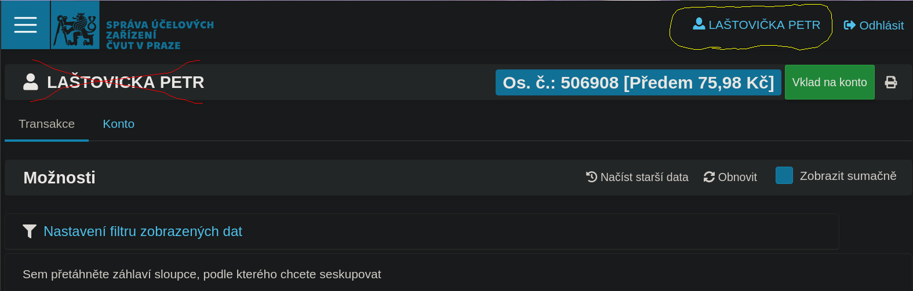
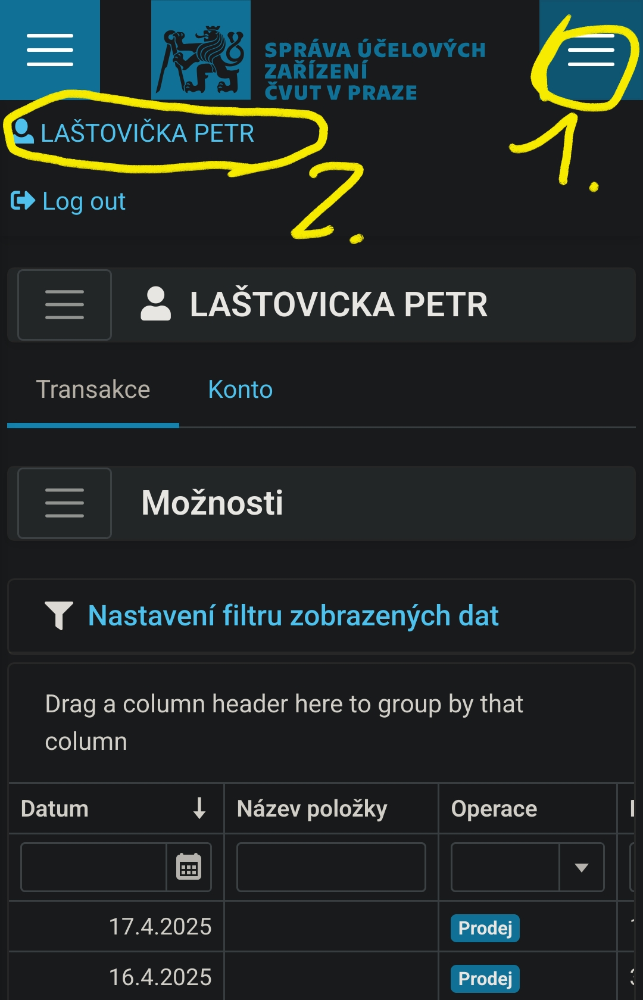
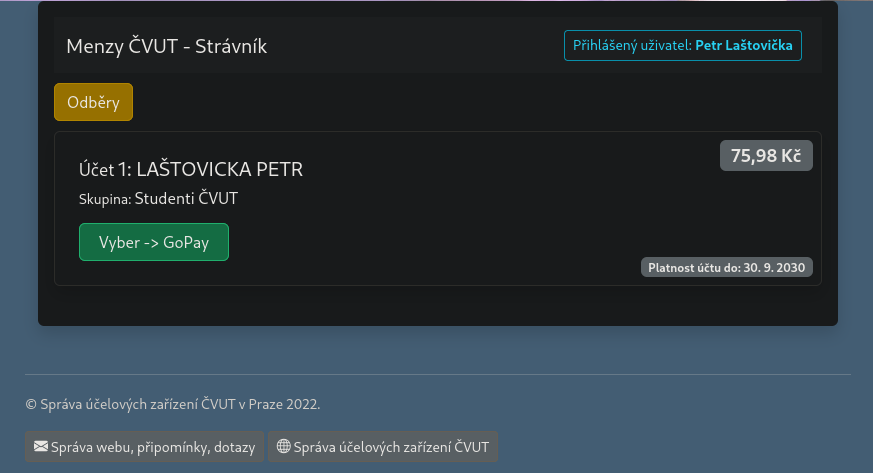

# Tutorial - Strávník signup

*TODO - Czech translation*.

For now you can use the automated translation from Google
[here](https://github-com.translate.goog/Lastaapps/menza/blob/main/docs/STRAVNIK_SIGNUP.md?_x_tr_sl=en&_x_tr_tl=cs&_x_tr_hl=en&_x_tr_pto=wapp).

This tutorial describes how you can create an account in
[Strávník portal](https://stravnik.suz.cvut.cz/) managed by SUZ CTU.
This should work if you are **a student of CTU or UCT**.
Otherwise, visit an office at Strahov or Studentský dům canteen.

## Errors in the tutorial

If something does not work for you, please
[create an issue](https://github.com/Lastaapps/menza/issues/new/choose).
The original discussion can be found in
[here](https://github.com/Lastaapps/menza/issues/26).

## Steps

- Go to [Agáta - Info page](https://agata.suz.cvut.cz/jidelnicky/stravnik.php) site.
- Log in using EduID.
- You should get into the Strávník portal.
  See example from web

  

  or from a phone.

  

  It may happen that you get redirected to Agáta Secure page.
  In this case click on the <b style="color:green;">GoPay</b> button that will redirect you to the Strávník portal.

  

- Once you are in the Strávník portal, click on your name to open the account options.
- In the password section, set a new password.
  It is also recommended to set your private email, so you can access
  your account even when you finish your studies.
- Got back to the main page and note the personal number (showed next to your balance).
  If the balance nor the personal number is shown, reload the page few times or
  wait a few minutes until they appear. The system does not work reliably (not my fault).
- Log into the Menza app using the personal number and your new password.
- Done!

## Forgotten password

Follow this section of the tutorial only in case
the login using EduID does not lead to directly to the Strávník portal,
but to this URL: `https://agata.suz.cvut.cz/secure/index.php`.

- Got to the Strávník
  portal [forgotten password](https://stravnik.suz.cvut.cz/Identity/Account/ForgotPassword) page.
- Try all your emails - personal ones, the one you used to sing up for the university,
  your university emails (both username@cvut.cz and username@faculty.cvut.cz).
- If you receive the email, follow steps in the section above.
- If not, please report me the issue and visit a SUZ office - there is probably nothing I can do.

## Common problems

- The website often does not show the balance amount.
  This is the reason why the app sometimes fails to fetch the balance.
  Refresh the page few times of after a minute, it should appear.
  There is nothing I can do on my side to fix this.
